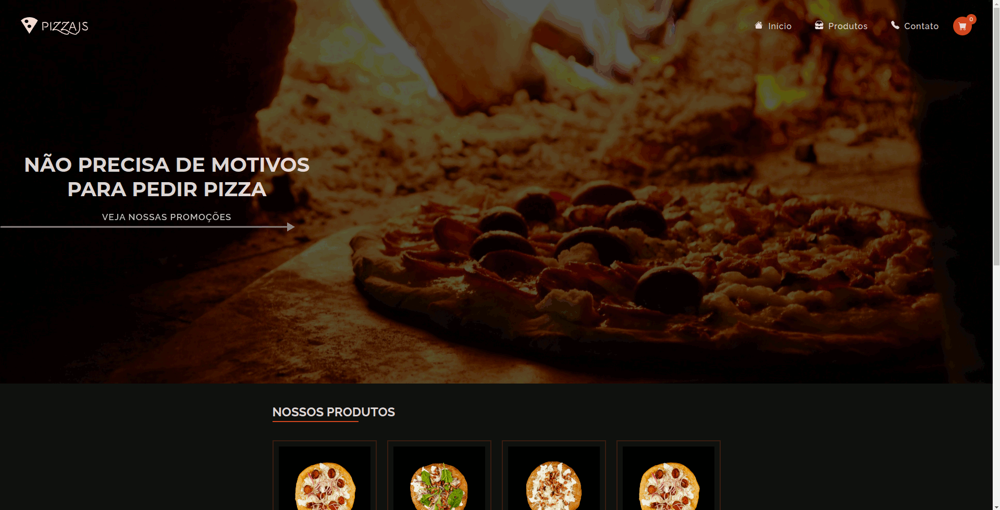

<h1 align="center">
    
    <br>
    Ecommerce Pizza
</h1>

<h3 align="center">Projeto de um ecommerce fictício de pizza</h3>

<div align="center" >
  
</div>

<p align="center"><a href="https://pizzajs-react.netlify.app/">Acessar Projeto</a></p>

# Sobre

Esse projeto é um ecommerce fictício de pizza, com fluxo de escolha, edição, carrinho e finalização do pedido.
Consumindo a api [via-cep](https://viacep.com.br/) para dar um complemento e seguindo o conceito Mobile-First.

# Tecnologias

<p>Foram usadas as seguintes tecnologias:</p>

- [Javascript](https://developer.mozilla.org/pt-BR/docs/Web/JavaScript);
- [ReactJS](https://pt-br.reactjs.org/);
- [Styled-Components](https://styled-components.com/);
- [MaterialUI](https://mui.com/pt/);
- [Redux-Toolkit](https://redux-toolkit.js.org/).

# Objetivo

Fazer um projeto que demanda-se mais tempo, planejamento e lógica.

# Aprendizados

- Fluxo de trabalho do Redux;
- Estruturar um projeto maior;
- Usar alguns componentes do MaterialUI, que por sinal são bem legais!;
- Muita responsividade.

<h1>Rodando o projeto: </h1>

OBS: É necessário que tenha o [NodeJS](https://nodejs.org/en/) e o [Git](https://git-scm.com) instalados em sua máquina!

```bash
1. Clone o repositório:
$ git clone https://github.com/gabriellima2/pizzajs.git

2. Acesse a pasta e instale as dependências via terminal:
$ yarn / npm install

3. Inicie a aplicação em modo de desenvolvimento:
$ yarn dev / npm run dev

4. O servidor será aberto em http://localhost:3000
```

<p align="center">Feito com 💙 por <a href="https://www.linkedin.com/in/gabriel-lima-860612236">Gabriel Lima</a></p>
