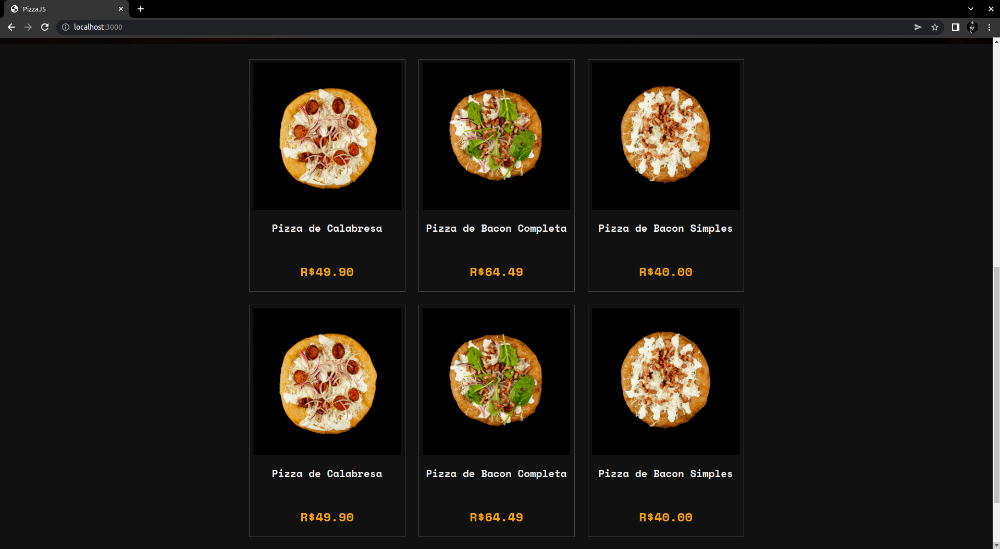
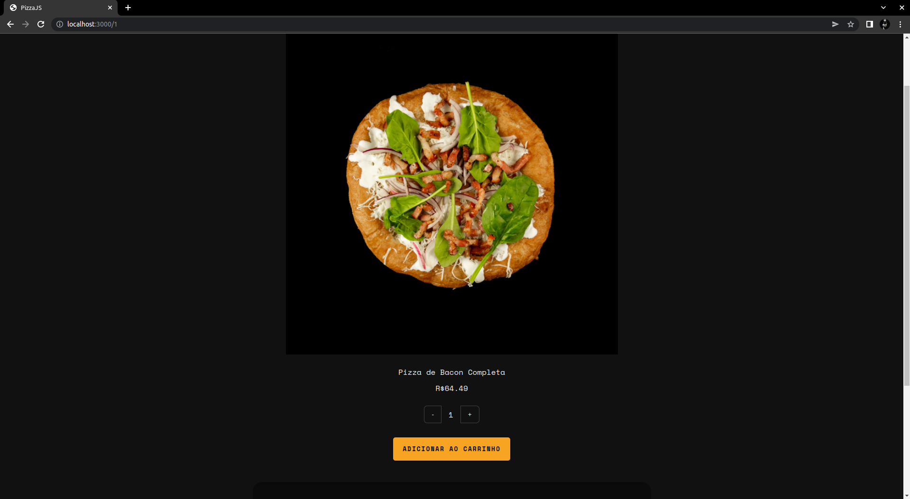
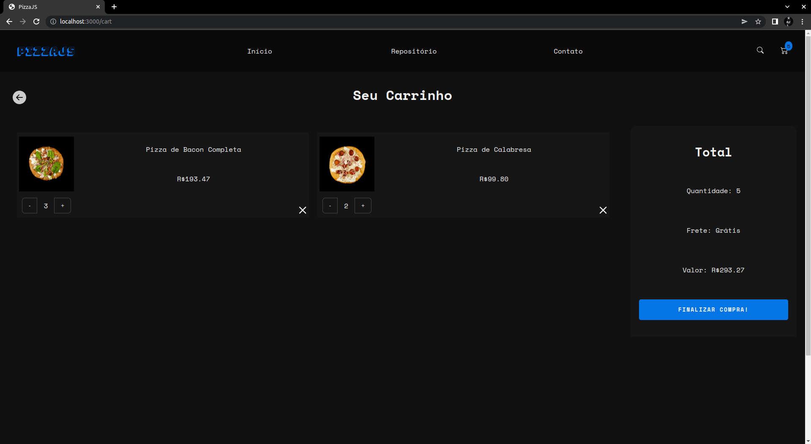

<h1>Pizza JS 🍕</h1>

<p>Projeto de comércio de pizza online!</p>
<p>Nele podemos ver os produtos, mudar a quantidade, adicionar e remover do carrinho.</p>

<h1>👨‍💻 Tecnologias usadas:</h1>

- [ReactJS](https://pt-br.reactjs.org/)
- [Styled-Components](https://styled-components.com/)
- [React-Router](https://reactrouter.com/)
- [Redux](https://redux.js.org/)
- [Vite](https://vitejs.dev/)

<h1>📚 Objetivos e Aprendizado:</h1>

<p>Queria fazer um projeto maior, que demanda-se mais tempo e organização e ao mesmo tempo muito aprendizado.</p>
<p>Então, usei o <a href="https://redux.js.org/" target="_blank">Redux</a>, pois nunca tinha feito nenhum projeto com ele. Deu para entender o fluxo de execução, passando por actions, reducers etc. Usei os Hooks como o useDispatch e useSelector. Mas achei que ficou meio complicado de entender o código, então pretendo adicionar o Duck Pattern e o Redux Toolkit, que já da uma boa organizada.</p>

<h1>📷 Imagens:</h1>

<h2>Tela Inicial</h2>

<table>
  <tr>
    <td align="top"></td>
    <td align="top"></td>
  </tr>
</table>

<h2>Rotas de Detalhes e Carrinho:</h2>

<table>
  <tr>
    <td align="top"></td>
    <td align="top"></td>
  </tr>
</table>

<h1>Rodando o projeto: </h1>

OBS: É necessário que tenha o [NodeJS](https://nodejs.org/en/) e o [Git](https://git-scm.com) instalados em sua máquina!

```bash
1. Clone o repositório:
$ git clone https://github.com/gabriellima2/pizzajs.git

2. Acesse a pasta e instale as dependências via terminal:
$ npm install

3. Inicie a aplicação em modo de desenvolvimento:
$ npm run dev

4. O servidor será aberto em http://localhost:3000
```
